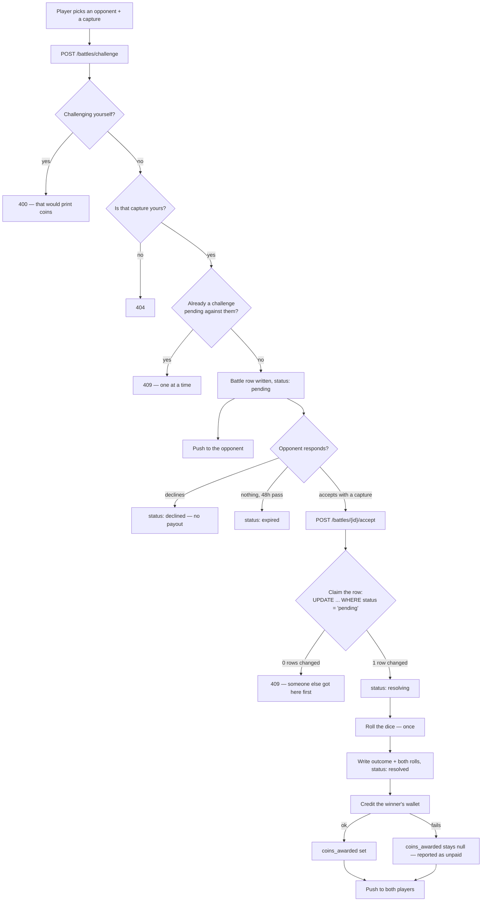

# How a battle works

What happens between one player tapping **Challenge** and both players seeing a result.

---

## The short version

1. You pick a player to fight and one of your captures to fight with.
2. They get a notification. Nothing is decided yet — the challenge just sits there.
3. When they answer, they pick a capture of their own.
4. At that moment, and only that moment, the battle is decided.
5. Rarer captures are stronger, a die roll adds luck, and a **trait** matchup can swing it.
6. The winner gets coins. The loser loses nothing.
7. If nobody answers within two days, the challenge expires and stops counting.

Battles are asynchronous on purpose — v1 has no WebSockets, and nobody has to be online
at the same time.

---

## The flow



---

## How a winner is decided

Each side's **power** is three things added together:

| Part | Value |
| --- | --- |
| Rarity base | common 10, uncommon 20, rare 35, legendary 60 |
| Die roll | 1–20, drawn fresh for each side |
| Trait bonus | +25, to whichever side's trait beats the other's |

Higher power wins. An exact tie is broken by one extra coin flip, so a battle always names
a winner — a battle that resolved to "nobody" would leave the challenge in limbo with no
screen to show.

A capture whose rarity never resolved fights as a **common**. That is the weakest
assumption available, so an unscored capture can't be used to smuggle in a strong fighter.

### Traits — the counterplay

Every species has one of three traits, in a cycle:

```
ferocity  beats  guile  beats  resilience  beats  ferocity
```

The trait is derived from the species name and is never stored, so it is the same on every
machine and never changes under a player. A capture with no identified species has no
trait, and neither gains a bonus nor grants one.

**Why +25:** it is worth roughly one rarity tier, which is the whole point.

| Matchup | Base gap | With the trait bonus |
| --- | --- | --- |
| legendary vs rare | 25 | The rare draws level — the roll decides |
| legendary vs uncommon | 40 | Still 15 behind, but a top roll can steal it |
| legendary vs common | 50 | Still 25 behind — unreachable, max roll gap is 19 |

So one tier of rarity can be played around and three cannot. Rarity still decides most
matchups — it is what the whole capture loop is about, and a legendary that could lose to
a sparrow would make finding one feel worthless. What traits add is a reason to keep a
**varied** roster instead of only ever fielding your single rarest capture.

Do not raise the bonus without re-reading that table: at +30, a common beats a legendary
on a good roll.

---

## What the winner earns

Keyed on the **defeated** capture's tier — beating a legendary is the achievement, beating
a sparrow is not.

| Defeated capture | Battle reward | Capture payout, for comparison |
| --- | --- | --- |
| legendary | 100 | 500 |
| rare | 40 | 200 |
| uncommon | 15 | 75 |
| common | 5 | 25 |
| unknown rarity | 5 | — |

Battle rewards are deliberately about a fifth of what photographing the same tier pays.
Battles are repeatable from the couch; captures require going outside and finding an
animal, which is the entire premise of the app. If a battle win ever out-earned a capture,
the optimal way to play would be to stop going outside. A test enforces this
(`test_battle_rewards_stay_below_capture_payouts`).

Beating an unscored capture still pays something, so players don't learn to dodge
opponents whose species lookup failed — not something those players did wrong.

The loser loses nothing in v1.

---

## Three things that are easy to get wrong

**A resolved battle must never re-roll.** `resolve_battle` throws dice, so the outcome and
both rolls are written to the row and read back from it. If the result screen recomputed
on read, the two players would see different numbers, and one player would see new numbers
every time they reopened the same finished battle.

**A battle must never resolve twice.** Two devices tapping Accept together both pass the
status check, so accept claims the row with a conditional `UPDATE ... WHERE status =
'pending'` and checks the rowcount. Only the transaction that actually changed a row
proceeds.

**The payout ordering is load-bearing.** The outcome is committed *before* the wallet is
touched, and `coins_awarded` stays null until the credit succeeds. A crash therefore leaves
a resolved battle that was never paid — visible and fixable — rather than one that could be
resolved and paid a second time. The same ordering is what makes it safe to reclaim a
resolution abandoned mid-flight (see below).

---

## Edge cases

| Situation | What happens |
| --- | --- |
| Nobody answers | Expires after 48h, swept lazily on the next read |
| Challenger's capture is deleted first | 409 — there is nothing to fight |
| Accept and decline race each other | Whichever claims the row wins; the other gets 409 |
| Process dies mid-resolution | Row is stuck in `resolving`; reclaimed to `pending` after 5 min |
| Payout fails | Battle stays resolved, `coins_awarded` is null, and the app says so |
| A stranger opens the battle | 404, not 403 — a 403 confirms it exists |

The reclaim window is measured from **when the attempt started** (`resolving_at`), not from
when the challenge was created. Keying it on `created_at` let a concurrent read hand an
in-flight battle back to `pending`, where it could be resolved and paid a second time.

---

## Endpoints

| Method | Path | What it does |
| --- | --- | --- |
| `GET` | `/battles` | Every battle you're in, newest first |
| `GET` | `/battles/{id}` | One battle — only the two players can read it |
| `GET` | `/battles/roster` | Your captures, as battle cards |
| `GET` | `/battles/opponents` | Players who own at least one capture |
| `POST` | `/battles/challenge` | `{opponent_id, capture_id}` → a pending battle |
| `POST` | `/battles/{id}/accept` | `{capture_id}` → resolves it |
| `POST` | `/battles/{id}/decline` | Turns it down |

`role` and `outcome` in a response are relative to **you**, so each player's screen can say
"You won" without working out which half of the row it is. Everything else — the rolls, the
totals, the winner — is identical for both players.

---

## Hand-offs

**In, from Person B:** a capture's `rarity_tier` is what decides a battle, so the roster is
only as good as the rarity engine.

**Out, to Person D:** the winner is paid through `credit_wallet` with reason
`"battle:win"`. That string is the contract the leaderboard aggregates on, not an internal
label — don't reword it casually. `credit_wallet` has no HTTP route on purpose: if the
client could call it, a player could pay themselves.

**Notifications:** Person D registers the device token (`POST /devices/register`); the
sending side is `app/services/push.py`. Both battle pushes carry
`{"type": "battle", "battle_id": ...}`, which the app reads on tap to know where to
navigate.
