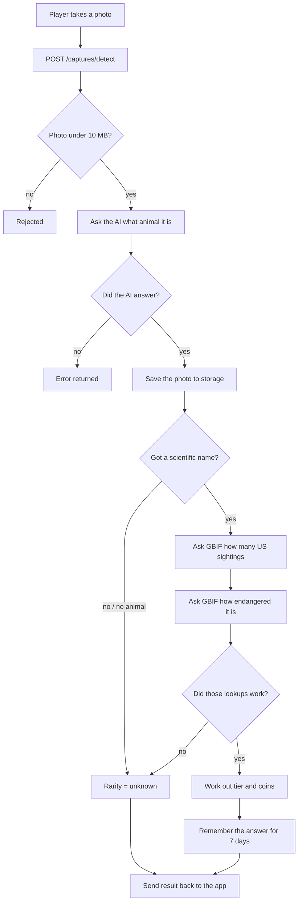

# How a capture works

What happens between a player tapping the shutter and getting points back.

---

## The short version

1. The app sends the photo to the backend.
2. An AI model looks at the photo and says what animal it is.
3. We ask GBIF (a wildlife database) how often that animal is seen in the US, and how endangered it is.
4. Those two numbers decide how rare it is, and how many coins it's worth.
5. If we can't work out any of this, we say **"unknown"** — we never guess.

---

## The flow



---

## Step by step

### 1. The photo arrives

`POST /captures/detect` — the app uploads the photo directly. Anything over **10 MB** is rejected, so a huge file can't tie up the server or waste an AI call.

### 2. The AI identifies the animal

We ask for three things back:

| Field | Example | Why we need it |
| --- | --- | --- |
| `species` | `House Sparrow` | What we show the player |
| `scientific_name` | `Passer domesticus` | What the wildlife database needs |
| `confidence` | `0.98` | How sure the AI is |

**Two AI providers, tried in order.** Gemini first; if it has no key or the call fails, OpenRouter takes over. Both return the exact same fields, so nothing downstream can tell which one answered. If *both* fail we return an error rather than inventing an animal.

> **Why the scientific name matters so much.** Everyday names don't work as lookups. We tested it: searching "Red Fox" returns a *Fox Sparrow*, "Grey Squirrel" returns a *flea that lives on squirrels*, and "House Sparrow" matches nothing at all. Scientific names are unique and official; everyday names aren't.

### 3. Working out how rare it is

Two questions to GBIF:

- **How many times has this animal been recorded in the US?** A cardinal has ~25 million records. A tiger has 142.
- **How endangered is it?** A conservation status like `LC` (least concern) or `EN` (endangered).

### 4. The score

| Situation | Tier | Coins |
| --- | --- | --- |
| Endangered (VU/EN/CR), **or** fewer than 10 US sightings | Legendary | 500 |
| Under 100 US sightings | Rare | 100 |
| Under 1,000 US sightings | Uncommon | 25 |
| Everything else | Common | 5 |

### 5. Remembering the answer

Wildlife facts barely change, and GBIF blocks us if we ask too often. So every answer is kept for **7 days** in fast storage (Redis). The second player to photograph a sparrow costs us no lookups at all.

Redis is the **only** cache. There's no copy in the database: a `species_cache` table existed but nothing ever read it, so it was removed. Anything the app needs to display later gets saved on the capture itself — which is also what stops a player's card changing after the fact, since species facts can be updated but a capture shouldn't be.

---

## When we don't know

The most important rule: **we would rather say "unknown" than guess.**

Rarity comes back as `null` when:

- the AI didn't give a scientific name
- there was no animal in the photo
- GBIF was down or rate-limiting us

`null` means *"we don't know"* — **not** "worth nothing" and **not** "common". Anything reading this must handle unknown separately.

> **Why this matters.** If a species can't be looked up, its sighting count reads as 0 — and 0 sightings means *legendary*. So a silent failure wouldn't look like a failure; it would hand out 500 coins for every photo, including house sparrows, and look perfectly normal while doing it. Failing loudly and refusing to score is the safer option.

We also **don't save failures**. Since answers are kept for 7 days, storing a failed lookup would keep that animal broken for a week. A 30-second outage should stay a 30-second outage.

---

## Trying it yourself

There's one endpoint, the real one. Send a photo to it:

```bash
curl -X POST \
  -H "Authorization: Bearer <your Supabase token>" \
  -F "file=@bird.jpg" \
  "http://localhost:8000/captures/detect-and-store?lat=39.8&lng=-98.5"
```

```json
{
  "species": "House Finch",
  "scientific_name": "Haemorhous mexicanus",
  "confidence": 0.75,
  "image_url": "...",
  "rarity": { "gbif_occurrence_count": 17532959, "iucn_status": "LC",
              "rarity_tier": "common", "coin_value": 5 }
}
```

A login token is required, and the photo really is stored — this is the production path, not a shortcut.

To get that token in a few seconds, see [dev-auth.md](dev-auth.md).

To check the scoring rules on their own without a photo, the tests cover every case
(`tests/test_species_rarity.py`), and they run without network or a database:

```bash
pytest tests/test_species_rarity.py -v
```

---

## Things worth knowing

**Animals common abroad score as legendary here.** Sightings are counted **US-only**. A Eurasian Blackbird has 7 US records but 13.4 million worldwide, so it scores legendary — the same as an endangered tiger. This is **intentional**: it's a location-based game, and spotting a bird that doesn't belong here is the exciting moment. Two side effects to keep an eye on:

- It's the easiest thing to cheat (photograph a foreign bird off a screen) and it pays the most. Anti-cheat has to handle that, not the scoring.
- Revisit at the Week 3 balance check if payouts feel wrong in playtesting.

**The AI sometimes gives a group name instead of a species.** We've seen `Troglodytidae` (a whole bird family) instead of one species. Families have far more sightings than a single animal, so those score as more common than they should. Known and accepted for now.

**Nothing is saved to the player's collection yet.** Rarity is calculated and handed back, but writing the capture record is the next piece of work.

**Requires Redis.** With no working Redis connection, every lookup fails and every capture comes back as unknown rarity. If everything suddenly scores `null`, check Redis first.
