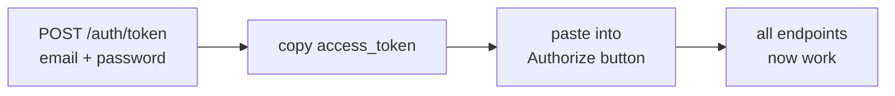

# Getting a login token for testing the backend

Most endpoints need you to be logged in. This page shows the quick way to get a token
so you can try them out in the API docs page.

**Takes about 2 minutes the first time, 10 seconds after that.**

---

## One-time setup

### 1. Put the project key in your `.env`

In the Supabase dashboard: **Project Settings → API Keys → `anon` `public`** → copy it.

Add it to `backend/.env`:

```
SUPABASE_ANON_KEY=<paste it here>
```

This key just says "I'm the AnimalGO project". It is not a login and it is safe to share
within the team. Restart the backend after adding it.

### 2. Make yourself a test account

In the Supabase dashboard: **Authentication → Users → Add user → Create new user**.

Pick any email and password. **Tick "Auto Confirm User"** — if you skip this, logging in
fails with "Email not confirmed" and there is no confirmation email to click.

---

## Every time you want to test

1. Open http://localhost:8000/docs
2. Find **`POST /auth/token`** (under **auth (dev)**), click **Try it out**
3. Fill in your email and password, click **Execute**
4. Copy the `access_token` from the response
5. Scroll to the top, click the green **Authorize** button, paste the token, click
   **Authorize**

Every endpoint on the page now sends your token automatically. Done.



> The token lasts about an hour. When calls start failing with
> **401 Invalid or expired token**, just repeat these five steps.

---

## What the different keys are

Supabase hands out several long strings that all start with `eyJ`. They are not
interchangeable, and picking the wrong one is the usual reason things don't work.

| String | What it is | Use it for |
| --- | --- | --- |
| **anon / publishable key** | identifies the *project* | goes in `.env`, never in the Authorize box |
| **service_role key** | full admin, bypasses all security | nothing in this project |
| **access token** | identifies *you*, from logging in | the Authorize box |

Only the access token says who you are. The backend reads your user ID out of it and
files every capture under that ID — a project key has no user in it, so it is rejected
even though Supabase really did issue it.

**Never paste the service_role key anywhere.** It ignores all access rules.

---

## When something goes wrong

| What you see | What it means | Fix |
| --- | --- | --- |
| `503` "Dev auth is not configured" | `SUPABASE_ANON_KEY` is missing from `.env` | do the one-time setup above, then restart the backend |
| `401` "Invalid login credentials" | wrong email or password | check them in the dashboard |
| `401` "Email not confirmed" | account was created without auto-confirm | delete the user and remake it with **Auto Confirm User** ticked |
| `401` "Missing bearer token" | you didn't click **Authorize** | click it and paste the token |
| `401` "Invalid or expired token" | token is over an hour old, or you pasted a project key | get a fresh one from `/auth/token` |
| `502` "Could not reach Supabase auth" | your machine can't reach Supabase | check your internet / that `SUPABASE_URL` is right |

One thing that is **not** an auth problem: `/captures/detect-and-store` returning
`"rarity": null`. That means the rarity lookup couldn't run — usually Redis being down.
Your token is fine. See [capture-flow.md](capture-flow.md).

---

## Notes for whoever deploys this

`POST /auth/token` is **a local development tool and must not be live in production.**

It takes a password and forwards it to Supabase. That is fine on your laptop, but on a
public server it would let anyone try passwords against our project through our API,
skipping the protections Supabase has on its own login endpoint.

**The off switch is `SUPABASE_ANON_KEY`.** Leave it unset in the deployed environment and
the endpoint returns 503 and never contacts Supabase. There is no separate flag to
remember, because the endpoint physically cannot work without that key.

The mobile app does not use this endpoint. It logs in to Supabase directly with
`EXPO_PUBLIC_SUPABASE_ANON_KEY` (see `mobile/.env.example`), so real users' passwords
never touch our backend.
